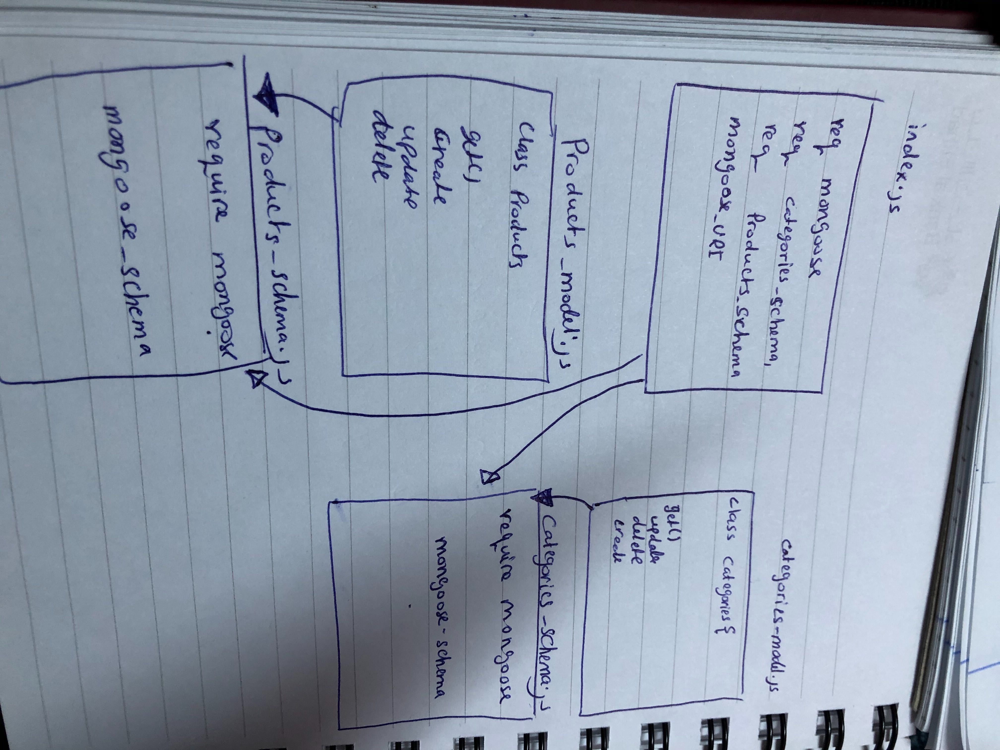

# lab-05-dataModelNoSQL

# LAB - Class 05

## Data Modeling With NoSQL Databases

### Author: muna

### Links and Resources

- [submission PR](https://github.com/401-advanced-javascript-muna/lab-05-data-model-nosql/pull/1)
- [ci/cd](https://github.com/401-advanced-javascript-muna/lab-05-data-model-nosql/actions) (GitHub Actions)

#### How to initialize/run your application (where applicable)

-  `npm run test`

#### Tests

- How do you run tests?
- Any tests of note?
- Describe any tests that you did not complete, skipped, etc

#### UML

Link to an image of the UML for your application and response to events

